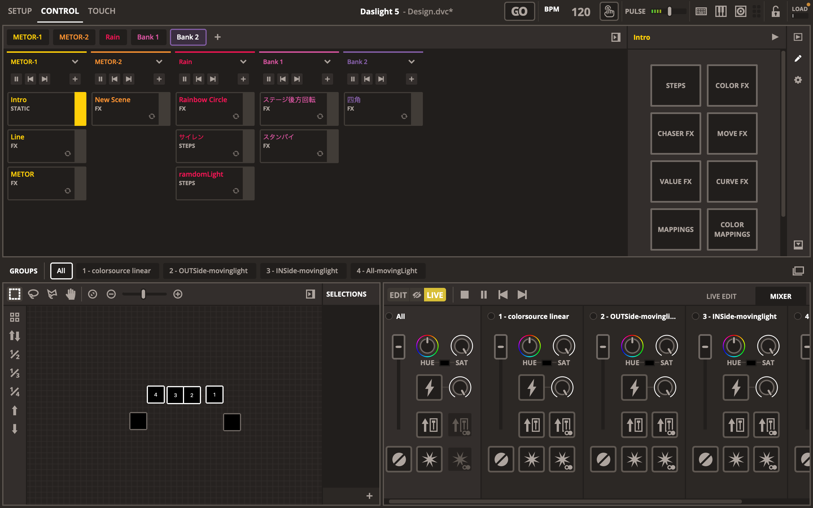

# 北見工業大学でライブの照明をやってきた話

お久しぶりです こばさんです。

北見工業大学の大学祭 [KitFes60](https://kitfes.com) で情報処理技術研究会とUDHI-LABが合同で実施したファンメイドライブ[KimIToMIKU](https://kimitomiku.live)の報告ブログになります。

まずはじめに、本ライブを開催にあたり協力していただいた関係者の皆様
クリエイティブチームを代表しまして、心より感謝しております
機材の貸出や各種手続きや私たちの要望,相談を親身になって対応してくださりました。

特に演出機材の導入にあたっては北見工業大学の担当者の皆様をはじめ、関係各所の方々と何度も話し合いを重ねて実現したものです
ご協力いただき本当にありがとうございました。

また、当日参加して頂いた皆様にも心から感謝しております。
ライブというものは、私たちと見ていただける皆さんがいて初めて完成する1つの大きな作品だと思っています。
誰かが『観測』して『感じ』てやっと完成する。
皆さんは大切なピースの1つです。
見に来てくれて本当にありがとう
きっとどこかでまた会えることを楽しみにしています。

ここからは私個人の記録として
KimIToMIKUがどのように作られ、その過程で何を感じたのかをまとめています。
拙い文章ですが、お付き合い頂ければ幸いです。

## KimIToMIKUの歴史

KimIToMIKUは元をたどると(私の知る範囲内では)釧路高専の高専祭に遡ります。

元々高専祭に部活動で出すものの1つとして、
[MMDAgent](http://www.mmdagent.jp)と呼ばれるソフトウェアを透過スクリーンに投影し
初音ミクといったキャラクターとリアルタイムにコミュニケーションを取れることをコンセプトに展示していました。

その後、このプロジェクトを推進していたsinohiroが北見工業大学へ進学
より楽しめるような形式の展示を考えた結果、MMDAgentの仕組みを用いてキャラクターに歌って踊らせようとなりました。

これが昨年度の工大祭で処理研が主催し展示していたものでした。
この展示にも当サークルのメンバーである`たかりん`と`polyacetal`が技術協力として参加しています。

今年は、参加していただいた方により楽しんでいただけるようなものに主軸を置き
一度MMDAgentから離れ、透過スクリーン等のノウハウを活かしたままライブという形式で実施することになりました。
規模の拡大に伴い、主催をsinohiro
私たちUDHI-LABから `こばさん` `たかりん` `polyacetal` `tomopu` を技術スタッフとして派遣しました。

## KimIToMIKUについて
>
> 「KimIToMIKU 2023」は初音ミクたちバーチャル・シンガーの3DCGライブを北見工業大学 大学祭 KITFes 60 で楽しむことができるイベントです。
私達と皆さんが感動や喜びを共有し、「KimIToMIKU 2023」が特別な思い出になることを願っています。

というコンセプトで実施しました。

TODO

名前からMIKU以外にKIT,ITを読めるような表記になるよう 映像プロデューサー のくたくが考案しました。

KitFesの2日間で1公演あたり1時間半程度のものを計4回実施し、総勢177名もの方にご来場いただきました。
セットリストは[公式サイト](https://kimitomiku.live/)で公開していますので、ぜひご覧下さい。

## クリエイティブチームについて

総勢16名で映像,演出,広報の3チーム体制でライブの制作にあたりました
各チームにはプロデューサーを置きチームの取りまとめ
主催を統括プロデューサーとして全体のコントロールするトップダウン型の組織構造を採用しました。

また当日もメンバー全体で大まかなシフトを組みながら 物販,会場内の誘導,非常時の対応を実施しました。

## 演出部門について

演出部門は私が演出プロデューサーを努め、

1. 避難誘導指示書,火災発生時の消火手順書の作成
2. 場内SE,アナウンスの制作
3. スタッフ用ネットワークの構築
4. 舞台照明のデザインと当日のコントロール
主にこの4つを担当しました。

各項目についてざっくりと説明しつつ思いの節を書いていきたいのですが、
ここでは主に `舞台照明のデザインと当日のコントロール`
について書いていきたいと思います。

## 舞台照明のデザインと当日のコントロールについて

具体的な照明の制御はぶっつけ本番でした。
プリセットを事前に組んだプリセットを適用しつつ、
リアルタイムでLIVEタブからフェードアウトさせたり色を変えたりしながら演出しています。

プリセットは過去に自分が参加したライブやアーカイブが閲覧できるものを参考にしました。
曲によっては、マジカルミライの演出を一部取り入れたりしています。

また、照明の方向にも気をつけました。
大規模なライブでは数多くの照明を用い、デザインすることで
点滅するような表現でも視界の明るさは大きく変わりません。

照明の数が少ない場合、参加者の方の視界に入ると眩しいだけでなく
不快感も増してしまうため、事前に照明の可動域を制限し直視する状況が発生しないよう対応しました。

<!--

### 手順書の作成

舞台照明を効果的に見せる手法として、会場内にスモークを炊くことが有効です。
今回のライブでも会場前方にスモークマシンを設置し運用しました。

非常時にスムーズな対応が出来るよう、各種手順書を作成しました。
避難誘導指示書には
公演中に発生した場合各スタッフがどのような対応を行うのかを具体的に記載し、
避難訓練も実施しました。

消火手順書には
消火栓などの位置の他に、消火を中止し避難を誘導する基準を定めるようにしました。

いずれも、参加者スタッフ全員が安全に公演を中止し、避難できることを第一としました。

### 場内SE,アナウンスの制作

場内SEとは会場内で流れているBGMのことです。

会場内にご案内のアナウンスを流しているのに、
BGMもなく淡々としていると寂しいので作成しました。

雰囲気づくりとしても効果的で曲構成もかなり気に入っています。
今でも聞くとワクワクしますね...

これ以外に、物販終了時刻の目安として活用しました。
終了時刻付近で強風オールバックを流すようにしていたりします。

こちらのブログの最後に、入退場それぞれの構成を載せておきます。

### スタッフ用ネットワークの構築

本ライブの投影は、透過スクリーン+プロセニアムの2エリアに行いました。
投影位置の関係上2台のPCを用い、低遅延同期再生を実施するために有線で構築しました。
また、スタッフ間の連絡にも用いています。

当日は不調気味でしたが、次年度は十分な対応を取れるように頑張ります。
ルーターも買いました。
-->
