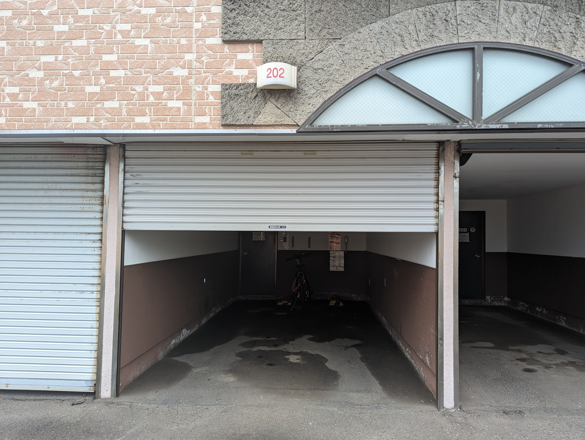
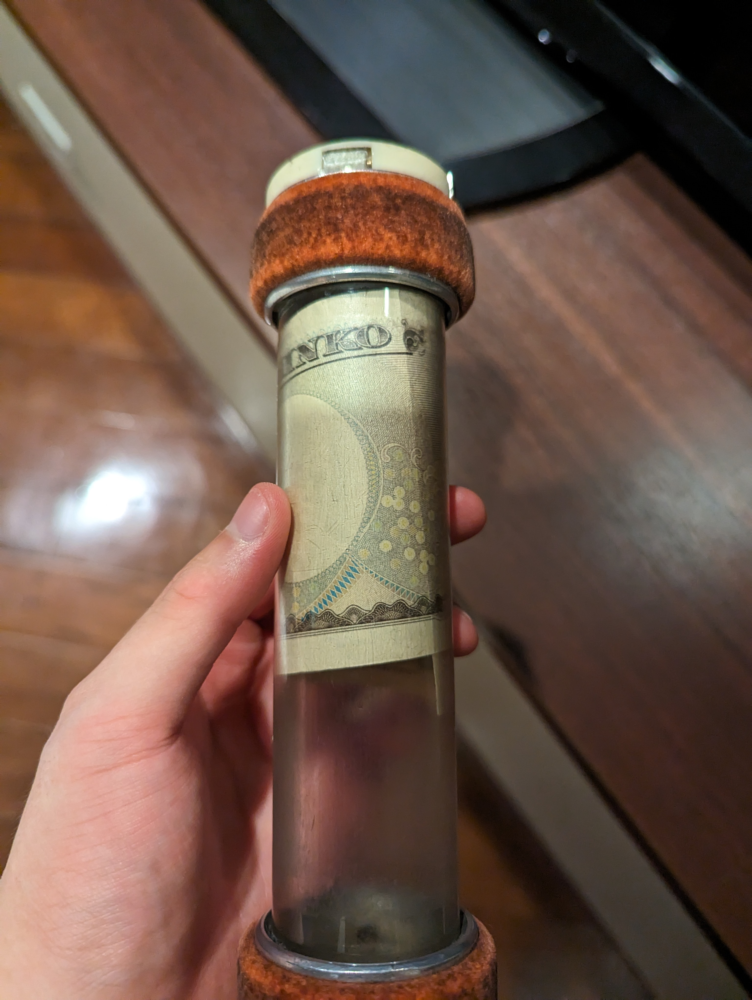

帯広の実家から帰ってきて早数時間、私は音をあげていました
部屋が暑いのです。  

これはなかなかに大きな問題です。  
昨今の地球温暖化やら異常気象やらに、例外なく釧路も巻き込まれているため  
コンスタントに例年より高い気温を叩きながら湿度で攻めてきます。  
室温32℃ 湿度62%  
不快指数も試算してみると82とか。  

自室にエアコンと呼べるものはスポットクーラーしかなく、流石にこの環境となると歯がたちません。  
リュックにPCやモバイルバッテリーを放り込み、夜の釧路に繰り出すこととしました。  

釧路において、この時間でも快適な場所で寝られる施設は限られてきます。  
自転車ではありますが、何十分も漕げるほどの気力もありません。  
行き先を漁っていたところ、10分ほどの場所にホテル街があることを思い出しました。  
物理的に火照る体を夜風に流しながら目的地へ向かいました。  

[^1]

ホテル街に着いたところで通り雨に降られてしまいました。  
仕方なくローソンの軒下で雨宿りしながら吟味します。  

通り雨に降られて雨宿り先となってくれるホテルを探す。  
シチュエーションとしては申し分無いですが、  
深夜1時を過ぎ、独り身となると少々強烈です。  

近場でそこそこ評価のものをチョイスし、足早に自転車を走らせます。  
綺羅びやかな塀を抜け、ドライブスルーのようなフロントにひと言かけると、  
開いているガレージに入ってシャッターを閉めてくれと言われます。  

[^2]

宿泊先を確定させた安堵感と共にガレージへ向かいシャッターを閉めます。  
二重の扉を開け階段を登り、マンションの一室に入るような気持ちで部屋に入りました。  

客室自体はそこそこの広さで24℃に設定されたエアコンが出迎えてくれました。  
勝確です。  
備え付けの電話が鳴っていて出ると、車で来ていない場合、料金は先払い式と言われました。  
人生初のエアシューターに心を踊らせながら支払いました。  

後の時間は部屋の中を物色したり、フリーWi-Fiの回線速度を測ったり、グダグダしながら過ごしました。  

[^3]

[^1]: エネルギー補給として購入しましたが、ダブルミーニングが過ぎます
[^2]: チェックアウトするときに撮ってみました
[^3]: 朝に測り直しました 結構良い数値出てますね