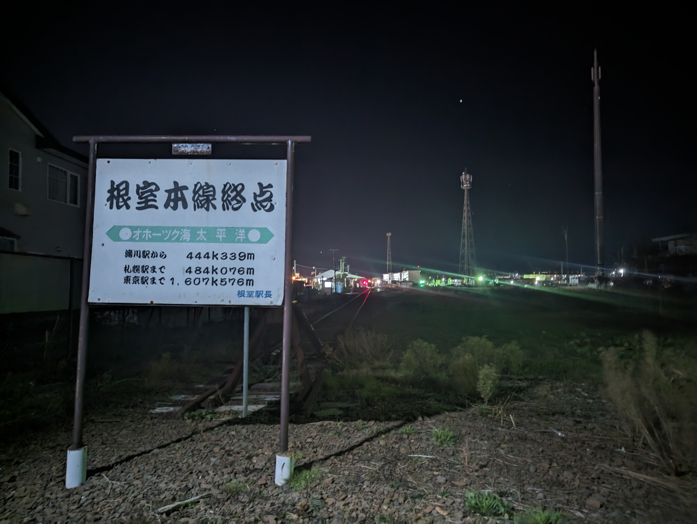

# エスカロップと神社とエスプレッソ

もともと暇を許せない性格で、関わりの無い土地に飛び込むことが好きだった。  
ここ数ヶ月、入院や高専祭など肉体を拘束されるイベントが多く、ぶらりと何処かへ旅立つことを忘れていた。  

久しぶりに健康的な睡眠で、7時過ぎには目が覚めた。  
特段予定もなく、ベッドの上で時間を潰す  
XのTLを流し見て、Youtube Shortsを見てを繰り返した。  

ふと、旅行がしたいという強烈な欲求が生まれた。  

旅行がしたい欲求は、市内を移動する程度では到底満たされない。  
唐突な思いつきを素直に実行に移すことが解消のコツだ。  

しかし、明日は早朝出発で札幌に行くため、宿泊しているだけの時間は無い。  
同じ道東で絞るなら、以前から乗りたかった花咲線で根室まで行こうとなった。  

気づけば9時過ぎ  
足早にシャワーを浴びて準備を進め、10時のバスに乗って釧路駅に向かった  

目的の無い旅も良いが、思い出が残らなければ意味がない。  
今回の一人旅では次のような『縛り』を設けた  

1. 根室市内の飲食店(ただし、チェーン店は除く)で何かを食べること  
2. 道中の音も楽しむため、イヤホンなどは付けないこと  

朝ごはんを駅ナカのおにぎり屋さん[^1]で済ませ、11時12分発 快速ノサップで向かった。  
車内には10数人が乗っていて、そこそこ利用者がいるんだなと驚いた。  
おやつで買った追加のおにぎりを待ちきれずに食べたり、車窓を見ながらうとうとしていると2時間ほどで根室に到着した。  

行き先をこの時間で決めようと思っていたが、予定が狂ってしまった。  
こういう時、誰からも怒ったり、呆れられたりせず気ままに行動できるのが一人旅の良いところだ。  

とりあえず、駅を出て見えた海岸に向かって歩き[^2]、満足してからは図書館で作戦会議と洒落込んだ。  

お昼をこちらで食べるために軽めの朝ごはんにしたこともあり、少々お腹が空いていたため昼食をどこで食べるか問題が発生した。  
チェーンではない飲食店かつ、根室ならではを満たすとなると、エスカロップ以外に選択肢はないだろう。  

Google Mapと[根室市観光協会](https://www.nemuro-kankou.com)を参考に[喫茶どりあん](https://maps.app.goo.gl/hzKBL9EAAe89XfH26)へお邪魔した。  
エスカロップ発祥に関連する店舗の1つで、たまたまオリジンに当たったようだった。  
(観光協会のホームページに記載されているだけはある...)  

食べた瞬間に広がるカツとデミグラスソースの味わいにバターベースで炒められたご飯  
ふと感じた親近感は、スパカツ由来だろう。  
きっと漁師町のソウルフードは根幹に同じものがあるのだろうという仮説が立った。  

次の目的地を探しながらモグモグしていると、[金刀比羅神社](https://www.nemuro-kotohira.com)なる神社を発見し向かうことにした。  

『そぞろ神のものにつきて心をくるわせ、道祖神の招きにあひて、取るもの手につかず』とは奥の細道の序文で  
授業で取り扱った時には、芭蕉も同じ想いを抱いたのだなと共感し感動したものだ。  
やはり、道祖神の招きを受けて異郷の地へ赴いたなら、土地神様にひとつ挨拶することも旅の礼儀というものだろう。  

心臓破りと思えるほどの急な坂を登り、東神門から境内にお邪魔した。  
(制礼台のところ[^3]から入れば正神門から入れたらしく、カラスがいっぱい居たのを避けたのはチキンだったなと後悔した)  

風車のトンネル[^4]を抜けるという新鮮な体験をしつつ、御社殿へ参拝に向かった。  

自払い棒で日々の穢れを落とすべく、方法をしっかりと読み込み身を清めた。  
(読んだくせに左から振るのを右から振ってしまって思わず自分に呆れたことを懺悔しておく)  

そのあとは、ご神木を巡ったりお守りを買っていると日も傾いてきたので  
ぼちぼち退散して、早めの夕食とした。  

根室名物その2 花咲ガニを食すべく[回転寿司 根室花まる](https://www.sushi-hanamaru.com)へ繰り出した。  
何気に神社から歩いて40分程かかるため、到着するころには強烈な海風で体は冷え切ってしまった。  

パンチの効いた二階建てシリーズに始まり、あさり汁は格別だった。  
もちろん、花咲ガニも頂いた。  

食べ終わるころには17時を過ぎて、日も落ちた頃  
釧路行きの列車は19時なので、2時間ほどの余裕が出来てしまった。  

とりあえず、駅に向かう道すがら根室本線終点を眺めに少し歩いた。  
肉眼では真っ暗で見えなかったので、Google謹製 Pixel7Proの出番である。  

さすが、Pixel  
北海道最西端の終点を見届けることが出来た。  

最後の訪問地として、本線終点のすぐ近く  
たまたま見つけた[cafe MYWING](https://www.mywing.info)に向かった。  

木造の温かみのあるお店で  
40年来のカフェとは思えない美しい外装と味のある店内は、かなり好きな雰囲気だった。  
一人と荷物のリュックだけで4人掛けのテーブルを占拠するのも忍びないなということで  
カウンターにお邪魔した。  

マスターも気さくな方で話も弾み、話題の広さには驚いた。  
昨今の半導体事情から始まり、十勝の学校における冬スポーツについて  
果てには建築資材とコーティング、トリプルガラスの話などを語らい  
結果1時間半ほど滞在した。  

また、コーヒーにもこだわりがあり、すべて自家焙煎  
ブレンド、マンデリン、エスプレッソと3杯程頂いた。  
エスプレッソは5年程飲んでいなかったが、久しぶりに飲むと美味しかった。  
イタリアでエスプレッソ元祖のメーカーから導入し、本場から帰国した友人と豆の比率から調整とのことで  
ある時来たお客様が飲んだ瞬間立ち上がり、本当に美味しいと握手を求められた話は印象深かった。  

サービスで多めの豆で淹れていただいた上に、ブレンドのペーパードリップまで頂いた。  
根室に立ち寄る機会があれば、是非伺いたいと思えるお店だった。  

19時前には後にし、そのまま19時04分発 釧路行きに乗って帰宅した。  

こうして、突拍子も無い根室旅行は終わりを迎え、欲求も縛りもクリアした素晴らしいものとなった。  

(オチは無い...)  

寒さも強くなり、日本海側では初雪が観測されたところ。  
雪が積もり、行動範囲が狭まりがちな冬の前に  
秋の最後の思い出をつくるべく、ぶらりと旅に出てみるのはいかがだろうか？  

釧路に着いた列車はそのまま摩周行きになった。  
力強い  

[^1]: 最近復活したおにぎり屋さん。焼きおにぎりの味噌が美味しかった。
[^2]: 海の見えない街で生まれたので憧れがある。近場の教会かと思った建物が雨水ポンプ場だったりした。
[^3]:  
[^4]: 